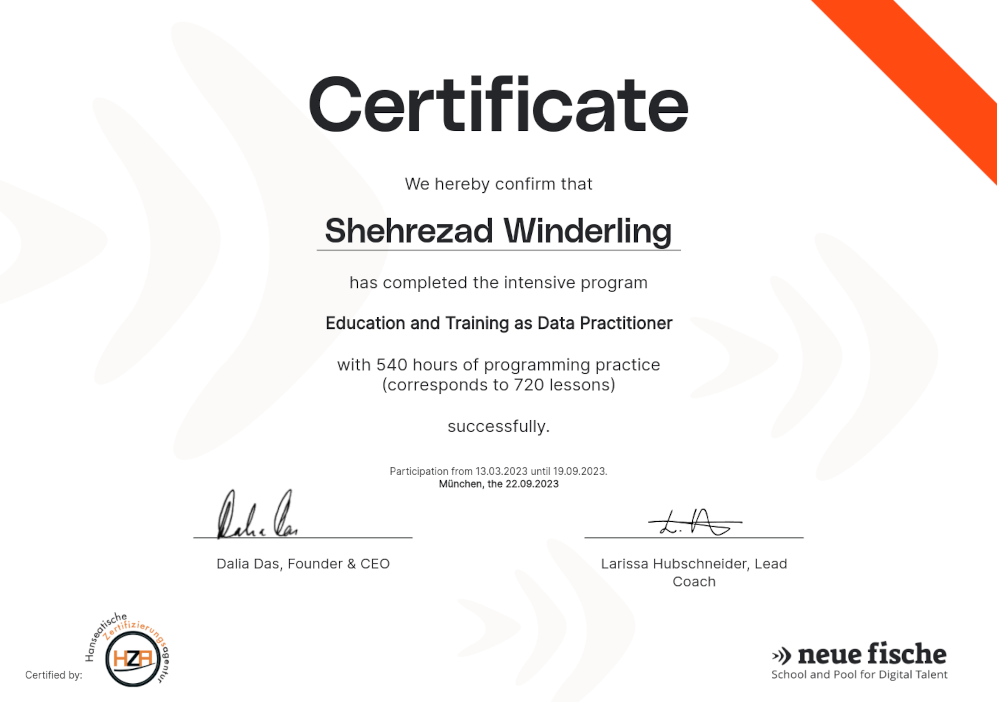

# 
 Project Portfolio 

  

 

  

 

## Hi, I'm Shahi, a web developer, certified data practitioner and pythonista 

### My repos: oldest to newest
- [EDA Project](https://github.com/ShahiW/eda_project_housing) (Data Practizioner Bootcamp)
- [Financial Inclusion Group Project](https://github.com/ShahiW/Financial-Inclusion-Project/tree/shahi) (DAta Practitioner Bootcamp - Group work)
- [MOOSIC](https://github.com/ShahiW/moosic/tree/main) (Data Practitioner Bootcamp - Group work)
- [Learning App](https://github.com/ShahiW/LearningApp) (Django Project - in progress)

 

---
 

### Short Intro:

I have a linguistics background. 
I studied german language and literature at the LMU in Munich. 

 

After graduating I started learning __HTML__, __CSS__ and a little bit of __JavaScript__ and worked for a short while as an intern in an advertising agency (d3media) in Hamburg. Then my interest shifted to web development and I learned __Python__. 2023 I attended a data practitioner bootcamp at the IT School neuefische Hamburg. I learned __Git/GitHub__, __SQL__, __Pandas__, __Numpy__, __Visualization (MatplotLib, Plotly, Seaborn)__, __web application streamlit__, __Machine Learning__ (Regression models, clustering, KNN, ...), __FAST APIs__ and working with __Tableau__. I obtained my Data Practitioner certificat after six months of training. In the last few months after finishing the bootcamp I learned __Python for andvanced users__, __Django__, __SQL Masterclass__ and __HTML-CSS Masterclass__ to get closer to my goal of being a web developer.

